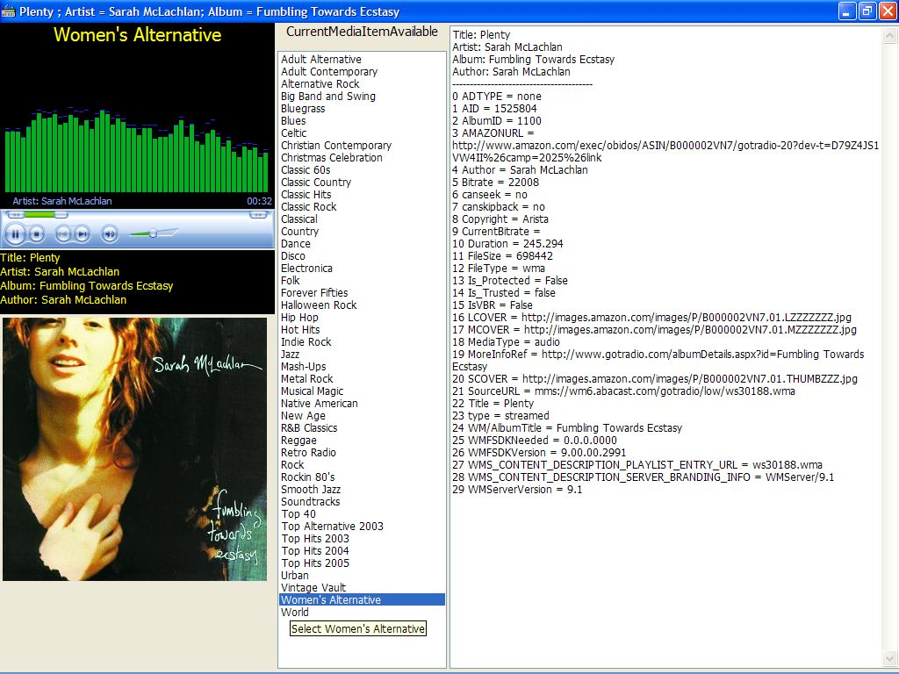

## GotRadio Player

### Description

I like to listen to the GotRadio stations at http://www.gotradio.com/, but I don't like the ads constantly cluttering up the screen. This application utilizes the windows media player control to connect to the desired station. It also retrieves all of the info about the song being played and downloads the album cover picture and displays it. I also implemented some code to hook the keyboard and utilize the multimedia keys (Play, FF, Stop, etc.). There are 46 channels to choose from and the only ads are the audio/video type, not the banners from the website. Comments and ideas to improve it are welcome. I modified it to add Christopher Lord's tray icon class and to fix the unnecessary reference to X10 class.
 
### More Info
 

             |
---                |---
**Submitted On**   |2006-03-19 16:49:32
**By**             |[Tom Pydeski](https://github.com/Planet-Source-Code/PSCIndex/blob/master/ByAuthor/tom-pydeski.md)
**Level**          |Intermediate
**User Rating**    |5.0 (30 globes from 6 users)
**Compatibility**  |VB 6\.0
**Category**       |[Sound/MP3](https://github.com/Planet-Source-Code/PSCIndex/blob/master/ByCategory/sound-mp3__1-45.md)
**World**          |[Visual Basic](https://github.com/Planet-Source-Code/PSCIndex/blob/master/ByWorld/visual-basic.md)
**Archive File**   |[GotRadio\_P1981493202006\.zip](https://github.com/Planet-Source-Code/tom-pydeski-gotradio-player__1-64703/archive/master.zip)

